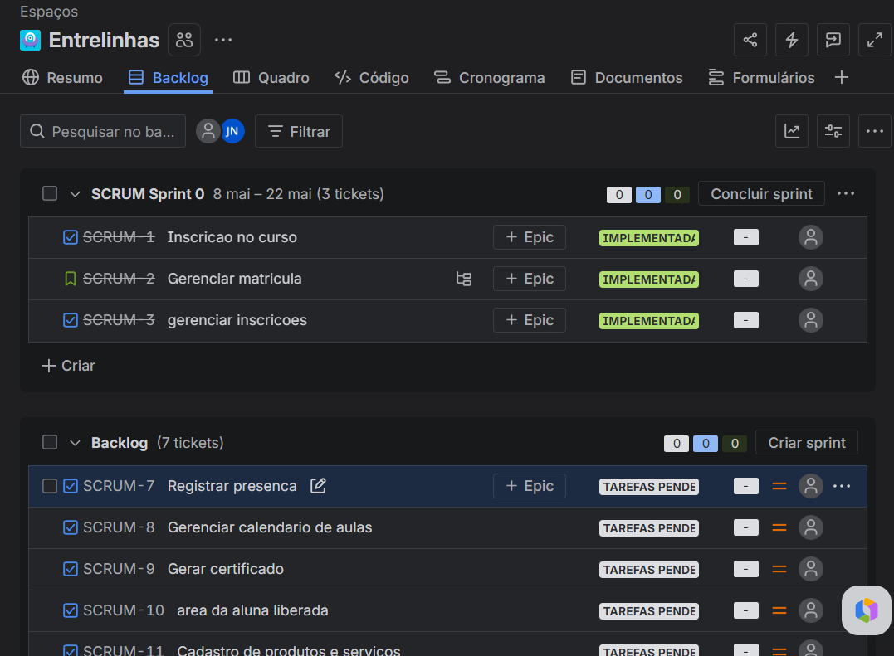

# Entrelinhas

Plataforma digital para gerenciamento de cursos de costura, acompanhamento de alunas e comercialização de produtos e serviços desenvolvidos dentro do projeto.

---

## Sobre o Projeto

O Entrelinhas é uma aplicação que integra inscrição em cursos, acompanhamento presencial e um bazar online.  
A proposta é unir aprendizado, organização e geração de renda dentro de uma única plataforma.

---
## Links

- [Protótipo no Figma](https://www.figma.com/design/h6YsEeVpd3D9KYrYruWpGY/Lo-fi-epicos?node-id=29-159&t=2rZ7MKiQh6C3mTaF-1)
- [Documentação no Google Sites](https://sites.google.com/cesar.school/entrelinhas/home)
- [Gestão do Projeto (Jira)](https://cesar-team-n9qvr2he.atlassian.net/jira/software/projects/SCRUM/boards/1/backlog?epics=visible&jql=parent%20IN%20%28SCRUM-8%2C%20SCRUM-9%2C%20SCRUM-10%29&selectedIssue=SCRUM-8)
- [Link deploy](https://entrelinhas-e759.onrender.com)

---
## Funcionalidades

### 1. Inscrição no Curso
- Formulário de inscrição
- Gerenciamento de inscrições
- Edição e cancelamento de matrícula

### 2. Plataforma de Acompanhamento
- Registro de presença
- Calendário de aulas
- Certificados
- Acesso dinâmico conforme matrícula

### 3. Bazar Online
- Cadastro de produtos e serviços
- Vitrine com filtros
- Gestão de vendas, doações e parcerias

---

## Metodologia

O projeto foi estruturado com base em Scrum:
- Épicos
- Histórias de usuário
- Critérios de aceitação (BDD)

---

## Histórias de Usuário

<details>
<summary>Historias</summary>


### Épico 1 • Formulário de Inscrição

<details>
<summary>H1 • Inscrição no curso</summary>

**Descrição**

Como aluna  
Quero me inscrever no curso preenchendo um formulário  
Para garantir minha participação

**BDD**

- Dado que estou na página de inscrição
- Quando preencho todos os dados obrigatórios corretamente
- E seleciono tipo de curso e disponibilidade
- E envio o formulário
- Então minha inscrição deve ser registrada com sucesso

- Dado que existem campos obrigatórios inválidos ou vazios
- Quando tento enviar o formulário
- Então devo receber mensagens de erro
- E a inscrição não deve ser concluída

- Dado que informo letras em campos que devem receber números, como CPF ou telefone
- Quando tento enviar o formulário
- Então devo receber uma mensagem informativa indicando que o campo deve conter apenas números
- E a inscrição não deve ser concluída

</details>

<details>
<summary>H2 • Gerenciar Inscrições</summary>

**Descrição**

Como administrador  
Quero visualizar as inscrições realizadas  
Para gerenciar os alunos do curso

**BDD**

- Dado que existem inscrições registradas
- Quando o administrador acessa a lista de inscrições
- Então deve visualizar os dados das alunas cadastradas

- Dado que não existem inscrições
- Quando acessa a tela
- Então deve ver uma mensagem informativa

- Dado que acessa a lista
- Quando visualiza uma inscrição
- Então deve ver nome, email e informações do curso

</details>

<details>
<summary>H3 • Gerenciar Matrícula</summary>

**Descrição**

Como aluna  
Quero editar ou cancelar minha matrícula  
Para manter meus dados atualizados ou desistir do curso

**BDD**

- Dado que tenho uma matrícula ativa
- Quando acesso meus dados
- E realizo alterações válidas
- Então minhas informações devem ser atualizadas

- Dado que tenho uma matrícula ativa
- Quando solicito cancelamento
- E confirmo a ação
- Então minha matrícula deve ser cancelada

- Dado que tento salvar dados inválidos
- Quando edito minha matrícula
- Então devo receber mensagem de erro

</details>

---

### Épico 2 • Plataforma de Acompanhamento

<details>
<summary>H1 • Registrar Presença</summary>

**Descrição**

Como instrutor  
Quero registrar presença das alunas  
Para acompanhar frequência

**BDD**

- Dado que estou na aula
- Quando marco presença de uma aluna
- Então a presença deve ser registrada

- Dado que a presença já foi registrada
- Quando acesso novamente
- Então devo ver o status salvo

</details>

<details>
<summary>H2 • Gerenciar calendário de aulas</summary>

**Descrição**

Como administrador/instrutor  
Quero cadastrar e atualizar aulas no calendário  
Para organizar os horários do curso

**BDD**

- Dado que estou no sistema
- Quando cadastro uma nova aula com data e horário
- Então ela deve aparecer no calendário

- Dado que altero uma aula existente
- Quando salvo as mudanças
- Então o calendário deve ser atualizado

- Dado que informo data ou horário inválidos
- Quando tento salvar a aula
- Então o sistema deve impedir o cadastro e exibir erro

</details>

<details>
<summary>H3 • Gerar certificado</summary>

**Descrição**

Como administrador  
Quero liberar o certificado  
Para que a aluna comprove a conclusão do curso

**BDD**

- Dado que a aluna concluiu o curso
- Quando atende os critérios
- Então o certificado deve ser liberado

- Dado que não concluiu
- Quando tenta acessar
- Então o certificado não deve estar disponível


</details>

<details>
<summary>H4 • Definir funcionalidade principal</summary>

**Descrição**

Como usuária  
Quero ver a funcionalidade principal de acordo com minha matrícula  
Para acessar rapidamente o que é mais relevante para mim

**BDD**

- Dado que a usuária está matriculada no curso
- Quando realiza login no sistema
- Então a plataforma de acompanhamento deve ser exibida como funcionalidade principal

- Dado que a usuária não está matriculada
- Quando realiza login
- Então o bazar deve ser exibido como funcionalidade principal

- Dado que a usuária não está logada
- Quando acessa o sistema
- Então o bazar deve ser exibido como funcionalidade principal

- Dado que o status de matrícula muda
- Quando a usuária acessa novamente o sistema
- Então a funcionalidade principal deve ser atualizada

</details>

---

### Épico 3 • Bazar Online

<details>
<summary>H1 • Cadastro de produtos e serviços</summary>

**História de Usuário**

Como administrador  
Quero cadastrar produtos e serviços no bazar  
Para disponibilizar itens com qualidade validada para venda

**Descrição**

Esta funcionalidade permite que o administrador cadastre produtos e serviços no bazar da plataforma, garantindo que os itens disponíveis sigam um padrão de qualidade da ONG. O cadastro deve incluir informações essenciais como nome, descrição, preço e categoria, permitindo que os itens sejam exibidos de forma organizada para os usuários.

**Cenários (BDD)**

- Cenário 1: Cadastro de produto ou serviço com sucesso
	- Dado que sou administrador da plataforma
	- Quando acesso a área de cadastro
	- E preencho os dados de um produto ou serviço corretamente
	- Então o item deve ser registrado no bazar

- Cenário 2: Cadastro de produto
	- Dado que estou cadastrando um produto
	- Quando informo nome, descrição, preço e categoria
	- Então o produto deve ser salvo corretamente

- Cenário 3: Cadastro de serviço
	- Dado que estou cadastrando um serviço
	- Quando informo descrição, tipo de serviço e valor
	- Então o serviço deve ser salvo corretamente

- Cenário 4: Validação de dados inválidos
	- Dado que preencho dados inválidos ou incompletos
	- Quando tento cadastrar
	- Então devo receber mensagem de erro

</details>

<details>
<summary>H2 • Vitrine de produtos e serviços</summary>

**História de Usuário**

Como usuária  
Quero visualizar produtos e serviços em destaque e filtrar  
Para encontrar rapidamente os melhores itens

**Descrição**

A vitrine deve destacar produtos e serviços selecionados, exibindo-os em uma área de destaque e permitindo que a usuária aplique filtros simples para facilitar a busca e navegação pelos itens disponíveis.

**Cenários (BDD)**

- Cenário 1: Visualizar produtos e serviços em destaque
	- Dado que acesso o bazar
	- Quando entro na vitrine de produtos
	- Então devo visualizar os itens em destaque

- Cenário 2: Filtrar produtos
	- Dado que estou na vitrine
	- Quando aplico filtros (categoria, preço, etc.)
	- Então devo ver apenas os produtos correspondentes

- Cenário 3: Nenhum resultado encontrado
	- Dado que aplico um filtro sem resultados
	- Quando a lista é atualizada
	- Então devo ver uma mensagem informativa

- Cenário 4: Navegação entre produtos
	- Dado que existem vários produtos
	- Quando navego pela vitrine
	- Então devo conseguir visualizar diferentes itens

</details>

<details>
<summary>H3 • Gerenciamento de vendas/doação</summary>

**História de Usuário**

Como administrador  
Quero visualizar e gerenciar vendas, doações e formulários recebidos  
Para acompanhar quem entrou em contato e organizar as solicitações

**Descrição**

Esta funcionalidade permite que o administrador visualize e gerencie informações relacionadas a vendas, doações e parcerias. A interface deve exibir os usuários que entraram em contato por meio de formulários, possibilitando o acompanhamento das solicitações e a organização dos dados recebidos.

**Critérios de Aceitação (BDD)**

- Cenário 1: Visualizar contatos recebidos
	- Dado que existem formulários enviados
	- Quando o administrador acessa a área de gerenciamento
	- Então deve visualizar a lista de pessoas que entraram em contato

- Cenário 2: Visualizar detalhes do formulário
	- Dado que existe um contato registrado
	- Quando seleciono um registro
	- Então devo visualizar todas as informações enviadas no formulário

- Cenário 3: Gerenciar solicitações
	- Dado que estou na lista de contatos
	- Quando marco ou organizo uma solicitação
	- Então o status deve ser atualizado corretamente

- Cenário 4: Nenhum contato registrado
	- Dado que não existem formulários enviados
	- Quando acesso a área
	- Então devo visualizar uma mensagem informativa

</details>

<details>
<summary>H4 • Enviar solicitação de doação ou parceria</summary>

**História de Usuário**

Como usuário interessado  
Quero enviar uma solicitação de doação ou parceria  
Para apoiar ou colaborar com a ONG

**Descrição**

Esta funcionalidade permite que usuários preencham um formulário de contato para realizar doações ou propor parcerias com a ONG. O formulário deve coletar informações básicas e a mensagem do usuário, permitindo que a administração receba e analise as solicitações.

**Cenários (BDD)**

- Cenário 1: Envio de solicitação com sucesso
	- Dado que estou na página de contato
	- Quando preencho os dados corretamente
	- E envio o formulário
	- Então a solicitação deve ser registrada com sucesso

- Cenário 2: Solicitação de doação
	- Dado que seleciono a opção de doação
	- Quando preencho meus dados e mensagem
	- Então a solicitação deve ser enviada para análise

- Cenário 3: Solicitação de parceria
	- Dado que seleciono a opção de parceria
	- Quando preencho meus dados e proposta
	- Então a solicitação deve ser enviada para análise

- Cenário 4: Validação de dados
	- Dado que deixo campos obrigatórios vazios ou inválidos
	- Quando tento enviar o formulário
	- Então devo receber mensagem de erro

</details>

</details>


---

## Protótipos

O prototipo Lo-fi Foi desenvolvido no figma representando as funcionaldades das histoias de usuario
[Acessar protótipo no Figma](https://www.figma.com/design/h6YsEeVpd3D9KYrYruWpGY/Lo-fi-epicos?node-id=29-159&t=2rZ7MKiQh6C3mTaF-1)

---
## Como rodar
<details> 
<summary>tutorial</summary>

### Clonar Projeto

```bash
git clone LINK_DO_REPOSITORIO
```

Entrar na pasta:

```bash
cd EntreLinhas
```

---

### Criar Ambiente Virtual

### Windows

```bash
python -m venv venv
```

---

### Ativar Ambiente Virtual

### PowerShell

```powershell
.\venv\Scripts\Activate.ps1
```

### CMD

```bash
venv\Scripts\activate
```

Após ativar aparecerá:

```text
(venv)
```

---

### Instalar Dependências

```bash
pip install -r requirements.txt
```

---

### Rodar Migrações

```bash
python manage.py makemigrations
```

```bash
python manage.py migrate
```

---

### Criar Superusuário

```bash
python manage.py createsuperuser
```

Preencher:
- username
- email
- senha

---

### Rodar Servidor

```bash
python manage.py runserver
```

---

### Abrir Projeto

Abrir no navegador:

```text
http://127.0.0.1:8000/
```

---

### Abrir Painel Administrativo

```text
http://127.0.0.1:8000/admin
```

---

</details>

## Estrutura do Projeto
<details>
<summary>Estrutura</summary>

```text
EntreLinhas/
│
├── manage.py
├── requirements.txt
├── README.md
├── .env
├── .gitignore
├── Procfile
├── runtime.txt
├── build.sh
├── render.yaml
│
├── configuracoes/
│   │
│   ├── __init__.py
│   ├── settings.py
│   ├── urls.py
│   ├── asgi.py
│   ├── wsgi.py
│   ├── permissions.py
│   └── context_processors.py
│
├── usuarios/
│   │
│   ├── migrations/
│   │   └── __init__.py
│   │
│   ├── templates/
│   │   └── usuarios/
│   │       ├── login.html
│   │       ├── cadastro.html
│   │       ├── perfil.html
│   │       └── editar_perfil.html
│   │
│   ├── __init__.py
│   ├── admin.py
│   ├── apps.py
│   ├── forms.py
│   ├── models.py
│   ├── services.py
│   ├── signals.py
│   ├── tests.py
│   ├── urls.py
│   ├── validators.py
│   └── views.py
│
├── inscricoes/
│   │
│   ├── migrations/
│   │   └── __init__.py
│   │
│   ├── templates/
│   │   └── inscricoes/
│   │       ├── inscricao.html
│   │       ├── sucesso.html
│   │       ├── listar_inscricoes.html
│   │       ├── detalhes.html
│   │       └── editar_matricula.html
│   │
│   ├── __init__.py
│   ├── admin.py
│   ├── apps.py
│   ├── forms.py
│   ├── models.py
│   ├── services.py
│   ├── tests.py
│   ├── urls.py
│   ├── validators.py
│   └── views.py
│
├── acompanhamento/
│   │
│   ├── migrations/
│   │   └── __init__.py
│   │
│   ├── templates/
│   │   └── acompanhamento/
│   │       ├── dashboard_aluna.html
│   │       ├── calendario.html
│   │       ├── presencas.html
│   │       ├── certificados.html
│   │       └── detalhes_aula.html
│   │
│   ├── __init__.py
│   ├── admin.py
│   ├── apps.py
│   ├── calendario.py
│   ├── certificados.py
│   ├── forms.py
│   ├── models.py
│   ├── services.py
│   ├── tests.py
│   ├── urls.py
│   └── views.py
│
├── bazar/
│   │
│   ├── migrations/
│   │   └── __init__.py
│   │
│   ├── templates/
│   │   └── bazar/
│   │       ├── home.html
│   │       ├── vitrine.html
│   │       ├── produto.html
│   │       ├── cadastrar_produto.html
│   │       ├── editar_produto.html
│   │       └── filtros.html
│   │
│   ├── __init__.py
│   ├── admin.py
│   ├── apps.py
│   ├── filters.py
│   ├── forms.py
│   ├── models.py
│   ├── services.py
│   ├── tests.py
│   ├── urls.py
│   └── views.py
│
├── parcerias_doacoes/
│   │
│   ├── migrations/
│   │   └── __init__.py
│   │
│   ├── templates/
│   │   └── parcerias_doacoes/
│   │       ├── contato.html
│   │       ├── parceria.html
│   │       ├── doacao.html
│   │       ├── listar_solicitacoes.html
│   │       └── detalhes_solicitacao.html
│   │
│   ├── __init__.py
│   ├── admin.py
│   ├── apps.py
│   ├── forms.py
│   ├── models.py
│   ├── services.py
│   ├── tests.py
│   ├── urls.py
│   └── views.py
│
├── dashboard/
│   │
│   ├── migrations/
│   │   └── __init__.py
│   │
│   ├── templates/
│   │   └── dashboard/
│   │       ├── admin_dashboard.html
│   │       ├── instrutor_dashboard.html
│   │       ├── visitante_dashboard.html
│   │       └── redirecionamento.html
│   │
│   ├── __init__.py
│   ├── admin.py
│   ├── apps.py
│   ├── services.py
│   ├── tests.py
│   ├── urls.py
│   └── views.py
│
├── templates/
│   │
│   ├── base.html
│   │
│   ├── components/
│   │   ├── navbar.html
│   │   ├── footer.html
│   │   ├── sidebar.html
│   │   ├── mensagens.html
│   │   ├── cards.html
│   │   └── modal.html
│   │
│   ├── registration/
│   │   ├── login.html
│   │   ├── logout.html
│   │   ├── password_reset.html
│   │   └── password_change.html
│   │
│   ├── errors/
│   │   ├── 403.html
│   │   ├── 404.html
│   │   └── 500.html
│   │
│   └── includes/
│       ├── alerts.html
│       ├── pagination.html
│       └── breadcrumbs.html
│
├── static/
│   │
│   ├── css/
│   │   ├── style.css
│   │   ├── dashboard.css
│   │   ├── formularios.css
│   │   ├── bazar.css
│   │   └── responsivo.css
│   │
│   ├── js/
│   │   ├── main.js
│   │   ├── calendario.js
│   │   ├── filtros.js
│   │   ├── dashboard.js
│   │   └── modal.js
│   │
│   ├── img/
│   │   ├── logo/
│   │   ├── banners/
│   │   ├── produtos/
│   │   ├── usuarios/
│   │   └── icons/
│   │
│   └── vendor/
│
├── media/
│   │
│   ├── certificados/
│   ├── produtos/
│   ├── usuarios/
│   └── documentos/
│
├── docs/
│   │
│   ├── backlog.md
│   ├── arquitetura.md
│   ├── casos_de_uso.md
│   ├── regras_de_negocio.md
│   ├── roadmap.md
│   └── DER.png
│
└── tests/
    │
    ├── test_usuarios.py
    ├── test_inscricoes.py
    ├── test_acompanhamento.py
    ├── test_bazar.py
    ├── test_dashboard.py
    └── test_parcerias.py 
```
</details>


---
## Entregas

<details>
<summary>Entrega</summary>

<!-- escrever aqui -->

### semana 1
<details>
<summary>Detalhes</summary>


- implementacao do epico de inscricao do curso com suas funcionalidades

### Quadro do backlog


### sprint

</details>


<!-- final da parte de entregas  -->
</details>


## Objetivo

- Facilitar o ingresso no curso  
- Melhorar o acompanhamento das alunas  
- Organizar a gestão do projeto  
- Permitir geração de renda para a ong através do bazar  

---

## Tecnologias

Definir conforme implementação.

---

## Autor

Grupo EntreLinhas

aa
